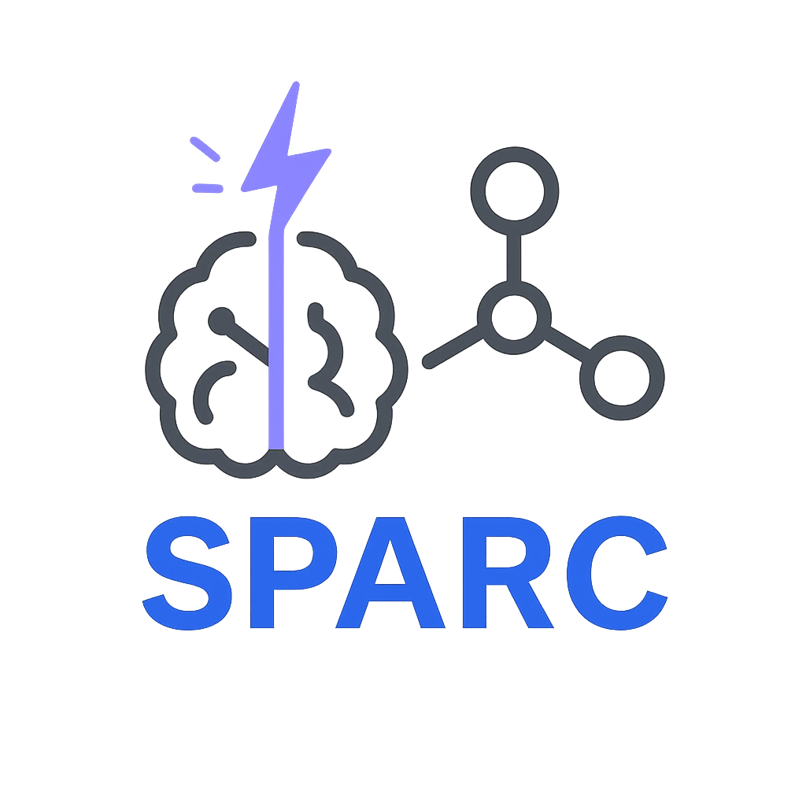

# SPARC

**S**mart **P**otential with **A**tomistic **R**are Events and **C**ontinuous Learning

<!--  -->


## Overview

SPARC is an open-source Python package that implements an active learning workflow for developing reactive machine learning potentials. It automates the process of running _ab-initio_ calculations, training ML models, and identifying new structures that need quantum mechanical labeling.

## Key Features

- Ab initio Molecular Dynamics (AIMD) using [VASP](https://www.vasp.at/)
- Machine learning potential training with [DeepMD-kit](https://github.com/deepmodeling/deepmd-kit)
- Deep Potential Molecular Dynamics (DPMD) simulations
- Active learning for continuous model improvement
- Reactive trajectory generation with [PLUMED](https://www.plumed.org/) integration

## Requirements

### Core Dependencies
- Python 3.xx
- [DeepMD-kit](https://github.com/deepmodeling/deepmd-kit) (version: 2.2.10)
- [ASE](https://wiki.fysik.dtu.dk/ase/) (Atomic Simulation Environment)
- [VASP](https://www.vasp.at/) (First-Principle Calculations)
- [PLUMED](https://www.plumed.org/) (PES Exploration)

### Python Package Dependencies
- numpy
- pandas
- dpdata

## Installation

<!-- conda create -n test_sparc -c conda-forge -c deepmodeling python=3.10 deepmd-kit=2.2.10 -->

1. Create and activate a conda environment:
```bash
conda create -n sparc python=3.10
conda activate sparc
```
2. Use any of following methods to install [Deepmd-kit](https://docs.deepmodeling.com/projects/deepmd/en/r2/getting-started/install.html) :

- #### pip
```bash
pip install deepmd-kit[gpu,cu12]==2.2.10
```
- #### conda-forge
```bash
conda install deepmd-kit=2.2.10=*gpu libdeepmd=2.2.10=*gpu lammps horovod -c https://conda.deepmodeling.com -c defaults
```
`Check known issues for any problem with DeePMD installation!`
<!-- # conda create -n cuda_test deepmd-kit=2.2.10=*gpu libdeepmd=2.2.10=*gpu lammps horovod -c https://conda.deepmodeling.com -c defaults -->

3. Clone and install SPARC:
```bash
git clone https://github.com/rahulumrao/sparc.git
cd sparc
pip install .
```
> [!Note]
>  Some Collective Variables (CVs), such as Generic CVs (e.g., SPRINT), are part of the `additional module` and are not included in a standard PLUMED installation. To enable them, we need to manually install PLUMED and wrap with Python:

4. Install PLUMED:

Download [PLUMED](https://www.plumed.org/download) package from the website, and install with the following flags (make sure conda env is active):
```bash
./configure --enable-mpi=no --enable-modules=all PYTHON_BIN=$(which python) --prefix=$CONDA_PREFIX

make -j$(nproc) && make install
```
> Refer to the official [PLUMED installation page](https://www.plumed.org/doc-v2.9/user-doc/html/_installation.html) for more details.


If you **don’t need additional modules**, you can skip the manual installation and install PLUMED directly from `conda-forge`.
```bash
conda install -c conda-forge py-plumed
```


## Quick Start

1. **Set Environment Variables:**

```bash
export VASP_PP_PATH=/path/to/vasp/potcar_files    # POTCAR files path
```

If you have installed PLUMED manually (skip if you used `conda-forge`), you also need to set the environment before running the code:

```bash
export PLUMED_KERNEL="$CONDA_PREFIX/lib/libplumedKernel.so"
export PYTHONPATH="$CONDA_PREFIX/lib/plumed/python:$PYTHONPATH"
```

2. **Prepare input file (see example below)**

### Example Input File
```yaml
general:
  structure_file: "POSCAR"   # Input structure

md_simulation:
  ensemble: "NVT"            # Ensemble for MD simulation
  thermostat: "Nose"         # Thermostat type (nose-Hoover)
  timestep_fs: 1.0           # TimeStep for MD simulation
  md_steps: 10               # Number of MD Steps
  temperature: 300           # Temperature in Kelvin
  log_frequency: 4           # Interval for MD log and save trajectories
  use_dft_plumed: False      # Use PLUMED for MD simulation

dft_calculator:
  name: "VASP"               # DFT package name
  prec: "Normal"             # Precision level
  kgamma: True               # Gamma point calculation
  incar_file: "INCAR"        # Path/Name of VASP input file

# Active Learning
active_learning: True        # Active Learning protocol
iteration: 10                # Number of Active Learning iteration
model_dev:
  f_min_dev: 0.1             # Force uncertainity cutoff/s
  f_max_dev: 0.8
```

Once the installation is complete and the required dependencies are setup, follow these steps to run SPARC.

Ensure you have the necessary input files (eg., input.yaml, input.json, INCAR, POSCAR). You can find a template in `scripts/input.yaml`.

3. **Run SPARC**

```bash
sparc -i input.yaml
```
Monitor log and output stored in `iter_xxxxxx` directories.

## Directory Structure
```bash
>> Project Root
├── INCAR
├── input.json
├── input.yaml
├──── Dataset
│      └── training_data
│      └── validation_data
├── iter_000000
│   ├── 00.dft
│   ├── 01.train
│   └── 02.dpmd
├── iter_000001
    ├── 00.dft
    ├── 01.train
    └── 02.dpmd
```

## Core Components

### 1. MD Simulation
- Supports both _ab initio_ and ML Molecular Dynamics within ASE
- NVT ensemble with Nose-Hoover and Langevin thermostat
- Checkpoint/restart capabilities
- Optional PLUMED integration for enhanced sampling

### 2. DeepMD Training
- Automated model training
- Multiple model generation for labelling
- Configurable network architecture and training parameters

### 3. Active Learning
- Query by Committee approach for structure selection
- Force-based deviation metrics
- Automated structure labeling and retraining

## Workflow

1. **Initial AIMD**
   - Data generation *ab initio* MD using VASP/CP2K

2. **ML Potantial (MLP) Training**
   - Process AIMD trajectories
   - Train multiple ML models
   - Freeze and compresses models

3. **MLP/MD Simulation**
   - Run MLP-MD using trained potential models
   - Monitor force deviations

4. **Active Learning**
   - Identifies structures for labeling
   - Performs DFT calculations (labelling) on selected structures
   - Retrain models with expanded dataset

## Current Status

- ✅ Fixed Model Update in Active Learning Iterations restart with added key:
  - `learning_restart: True`
  - `latest_model: 'path/to/frozen_model.pb'`
- ✅ Implemented Langevin Themostat
- ✅ Structured log formatting for better readability
- ✅ Preliminary support for the CP2K calculator implemented; full validation and testing are pending.
- ✅ Utility tools for analysis of ML model accuracy, active learning status, and simulation properties.

## Planned Updates
- 🚧 Code refinement in progress
- 🚧 Support for additional DFT calculators planned
- 📝 Documentation under development

> [!IMPORTANT]  
> There are some version dependencies, currently the latest version of `deepmd-kit` is not supported. Check [documentation](https://deepmd-kit.readthedocs.io/en/latest/install/easy-install.html) for installation of older version.

## Limitations

- Currently only supports DeepMD-kit 2.2.10 (newer versions not yet supported)
- Limited to VASP for DFT calculations
- Documentation is still being developed

## Known Issue
> [!IMPORTANT]  
> - Deepmd-kit `pip install tensorflow[and-cuda]` installation soetimes does not detect GPU.  
> - To verify if TensorFlow detects your GPU, run the following command:  
>   ```bash
>   python -c "import tensorflow as tf; print(tf.config.list_physical_devices('GPU'))"
>   ```
> Check [TensorFlow pip installation](https://www.tensorflow.org/install/pip) page to fix this. \
> 
> Some hardware have also shown issues with `conda` channels
> ```bash
> LibMambaUnsatisfiableError: Encountered problems while solving:
>  - nothing provides __cuda needed by libdeepmd-2.2.10-0_cuda10.2_gpu
>  - nothing provides __cuda needed by tensorflow-2.9.0-cuda102py310h7cc18f4_0
> - Could not solve for environment specs
> - The following packages are incompatible
> - ├─ deepmd-kit 2.2.10 *gpu is not installable because it requires
> - │  └─ tensorflow 2.9.* cuda*, which requires
> - │     └─ __cuda, which is missing on the system;
> - └─ libdeepmd 2.2.10 *gpu is not installable because it requires
> -  └─ __cuda, which is missing on the system.
> ```

## Dcumentation:
``` bash
pip install sphinx sphinx-autodoc-typehints sphinx_rtd_theme
```

## License

This project is licensed under the MIT License.

<!-- ## Support -->

## Contributing

Contributions are welcome! Please feel free to submit a Pull Request.

---
> [!WARNING]
> This package is under active development. Features and APIs may change.

> [!WARNING]
> This code is designed to work in a Linux environment. It may not be fully compatible with macOS systems.

