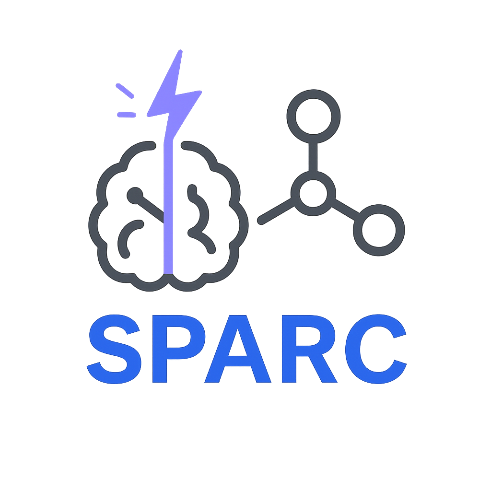

# SPARC

[](./LICENSE)
[](https://www.python.org/)
[](https://github.com/rahulumrao/sparc/stargazers)
[](https://github.com/rahulumrao/sparc/network/members)
[](https://github.com/astral-sh/ruff)
[](https://docs-sparc.readthedocs.io/en/latest/)
[](https://github.com/rahulumrao/sparc/actions)
[](https://doi.org/10.21105/joss.09468)

**S**mart **P**otential with **A**tomistic **R**are Events and **C**ontinuous Learning

<!--  -->


For More Information, Please Visit [SPARC Documentation](https://docs-sparc.readthedocs.io/en/latest/).

Try SPARC [Tutorial](https://github.com/rahulumrao/sparc/blob/main/examples/SPARC_Tutorial.ipynb)
[](https://colab.research.google.com/github/rahulumrao/sparc/blob/main/examples/SPARC_Tutorial.ipynb)

## Overview

SPARC is a Python toolkit for active-learning (AL) workflow to build a reactive machine learning interatomic potentials (MLIPs). It automates the process of identifying informative configurations in the configurational space without having to run a long initial _ab-initio_ MD trajectories. SPARC is designed to work seamlessly within the Python framework to efficiently improve ML model.

## Key Features

- Automated active learning with QbC candidate discovery
- DFT backends via ASE: [VASP](https://www.vasp.at/), [CP2K](https://www.cp2k.org/), [ORCA](https://www.faccts.de/orca/), [Quantum Espresso](https://www.quantum-espresso.org/),[Gaussian](https://gaussian.com/), [xTB](https://github.com/grimme-lab/xtb)
- _Ab initio_ molecular dynamics (AIMD) with enhanced sampling
- Machine learning potential training with [DeepMD-kit](https://github.com/deepmodeling/deepmd-kit), and [DeepMD-GNN](https://github.com/deepmodeling/deepmd-gnn)
- NVE/ NVT/ NPT simulations and iterative model refinement
- Reactive trajectory generation with [PLUMED](https://www.plumed.org/) integration

## Requirements

### Core Dependencies
- Python 3.10 recommended
- [DeepMD-kit](https://github.com/deepmodeling/deepmd-kit) (version: 2.2.10)
- [ASE](https://wiki.fysik.dtu.dk/ase/) (Atomic Simulation Environment)
- [PLUMED](https://www.plumed.org/) (PES Exploration)
- `ase`, `numpy`, `pandas`, `scipy`, `dpdata`, `cython`

### DFT Engine

Install and configure at least one:

- [VASP](https://www.vasp.at/)
- [CP2K](https://www.cp2k.org/)
- [ORCA](https://www.faccts.de/orca/)
- [Quantum ESPRESSO](https://www.quantum-espresso.org/)
- [xTB](https://github.com/grimme-lab/xtb)
- [Gaussian](https://gaussian.com/)

## Installation

### A) Legacy Installation (original compatibility flow)

1. Create and activate a conda environment:

```bash
conda create -n sparc python=3.10
conda activate sparc
```

2. Install DeepMD-kit:

```bash
# pip option
pip install deepmd-kit[gpu,cu12]==2.2.10

# conda option
conda install deepmd-kit=2.2.10=*gpu libdeepmd=2.2.10=*gpu lammps horovod -c https://conda.deepmodeling.com -c defaults
```

3. Clone and install SPARC:

```bash
git clone --depth 1 https://github.com/rahulumrao/sparc.git
cd sparc
pip install .
```

4. Install PLUMED:

```bash
# standard installation
conda install -c conda-forge py-plumed
```
   > [!NOTE]
   >  Some Collective Variables (CVs), such as Generic CVs (e.g., SPRINT), are part of the `additional module` and are not included in a standard PLUMED installation. To enable them, we need to manually install PLUMED within Python environment. If you **don’t need additional modules**, you can skip the manual installation and install PLUMED directly from `conda-forge` as shown in the previous step.

```bash
./configure --enable-mpi=no --enable-modules=all PYTHON_BIN=$(which python) --prefix=$CONDA_PREFIX
make -j$(nproc) && make install
```

5. Optional Install [DeePMD-GNN](https://github.com/deepmodeling/deepmd-gnn) plugin for [MACE](https://github.com/ACEsuit/mace) and [NeQUIP](https://github.com/mir-group/nequip) support:

```bash
conda install deepmd-gnn -c conda-forge
export CMAKE_PREFIX_PATH="$(python -c 'import torch; print(torch.utils.cmake_prefix_path)'):$CONDA_PREFIX"

# Optional
conda install -c nvidia cuda-toolkit=12.1 cuda-nvcc=12.1 cuda-nvtx=12.1 cuda-nvrtc=12.1 cuda-cudart-dev=12.1 cuda-cupti=12.1 -y
# Optional
conda install pytorch pytorch-cuda=12.1 -c pytorch -c nvidia -y
```
> Refer to the official [DeePMD-GNN](https://docs.deepmodeling.com/projects/deepmd/en/stable/third-party/out-of-deepmd-kit.html) installation page.

### B) Recommended Installation

```bash
conda create -n sparc -c conda-forge -y \
  python=3.10 deepmd-kit=3.1.1 deepmd-gnn=0.1.1 py-plumed plumed \
  xtb-python cmake cxx-compiler eigen openblas \
  nlohmann_json ninja liblapacke pybind11 scikit-build-core

conda activate sparc
git clone --depth 1 https://github.com/rahulumrao/sparc.git
cd sparc
pip install .
```
Verification:

```bash
python -c "import deepmd, plumed; print('deepmd', deepmd.__version__)"
python -c "import plumed; plumed.Plumed(); print('PLUMED OK')"
sparc --help
```

## Environment Setup

```bash
export VASP_PP_PATH=/path/to/vasp/potcar_files    # POTCAR files path
```

If PLUMED is installed manually (skip for `conda-forge`), we need to set PLUMED environment before running the code:

```bash
export PLUMED_KERNEL="$CONDA_PREFIX/lib/libplumedKernel.so"
export PYTHONPATH="$CONDA_PREFIX/lib/plumed/python:$PYTHONPATH"
```
## Quick Start

1. **Set environment variables** (see [Environment Setup](#environment-setup) above).

2. **Prepare input files** — you need `input.yaml`, `input.json`, and DFT engine specific files (e.g., `INCAR`, `POSCAR` for VASP).

   > [!NOTE]
   > A minimal example is shown below. For the complete input schema — including PLUMED, distance metrics, DEAL, and output options — see `examples/` and `scripts/input.yaml`, or the documentation page.

3. **Run SPARC:**

```bash
sparc -i input.yaml
```

Monitor logs and outputs in `iter_xxxxxx/` directories.

### Example Input File

```yaml
# ============================================================
# SPARC INPUT Example [VASP]
# ============================================================
# VASP requires POTCAR files for each element. Ensure VASP is licensed.
# Full template: examples/ and scripts/input.yaml

general:
  structure_file: ["POSCAR"]

dft_calculator:
  engine: "VASP"               # DFT engine
  template_file: "INCAR"       # VASP input template
  exe_command: "mpirun -np 4 vasp_std"

aimd_setup:
  ensemble: "NVT"
  temperature: 300             # Target temperature [K]
  thermostat:
    type: "Langevin"           # "Langevin" or "Nose"
    friction: 0.10
  timestep_fs: 1.0
  steps: 100

mlip_setup:
  training: true
  data_dir: "Training_Data/00.data"
  input_file: "input.json"
  num_models: 2                # Committee size for QbC
  MdSimulation: true
  ensemble: "NVT"
  temperature: 300
  md_steps: 2000

active_learning: true
iteration: 10
model_dev:
  f_min_dev: 0.05              # Force deviation lower bound [eV/Å]
  f_max_dev: 0.50              # Force deviation upper bound [eV/Å]
```

## Directory Structure

```text
Project Root/
├── POSCAR
├── INCAR
├── input.json
├── input.yaml
├── Training_Data/
├── iter_000000/
│   ├── 00.dft/
│   ├── 01.train/
│   └── 02.dpmd/
└── iter_000001/
    └── ...
```
## Core Components

### MD Simulation

- AIMD and ML-MD via ASE
- NVE, NVT, NPT ensembles
- Restart/checkpoint support
- PLUMED for enhanced sampling exploration

### MLIP Training

- DeepMD and MACE model training
- Fine-tuning for universal models

### Active Learning

- QbC model deviation analysis
- Candidate labelling and iterative refinement
- RMSD filtering for candidate scrutiny
- Optional GP-based diversity filtering (when available)

## Current Status

- Additional ASE DFT backends: ORCA, Quantum ESPRESSO, Gaussian, and xTB.
- DeePMD-kit v3 / PyTorch `.pth` support, with filesystem-first model detection and backend mismatch checks
- Optional fine-tuning of DPA universal models via top-level `finetune:` config
- NPT ensemble support, linear temperature ramping (`temp_end`), and improved ML/MD checkpoint resume
- Consolidated QbC candidates into a single `candidates.extxyz` trajectory
- Kabsch RMSD duplicate filtering for candidate selection
- PLUMED MDLogger compatibility fix for on-the-fly biased runs

## Planned Updates
- Code refinement in progress
- Support for LAMMPS and other MLIP models
- Documentation under development

<!-- > [!IMPORTANT]  
> There are some version dependencies, currently the latest version of `deepmd-kit` is not supported. Check [documentation](https://deepmd-kit.readthedocs.io/en/latest/install/easy-install.html) for installation of older version.

## Limitations

- Currently only supports DeepMD-kit 2.2.10 (newer versions not yet supported)
- Limited to VASP for DFT calculations
- Documentation is still being developed -->

## Known Issue
> [!IMPORTANT]  
> - We have noticed Deepmd-kit `pip install tensorflow[and-cuda]` installation sometimes does not detect GPU.  
> - To verify if TensorFlow detects your GPU, run the following command:  
>   ```bash
>   python -c "import tensorflow as tf; print(tf.config.list_physical_devices('GPU'))"
>   ```
> Check [TensorFlow pip installation](https://www.tensorflow.org/install/pip) page to fix this. \
> 
> Some hardware have also shown issues with `conda` channels
> ```bash
> LibMambaUnsatisfiableError: Encountered problems while solving:
>  - nothing provides __cuda needed by libdeepmd-2.2.10-0_cuda10.2_gpu
>  - nothing provides __cuda needed by tensorflow-2.9.0-cuda102py310h7cc18f4_0
> - Could not solve for environment specs
> - The following packages are incompatible
> - ├─ deepmd-kit 2.2.10 *gpu is not installable because it requires
> - │  └─ tensorflow 2.9.* cuda*, which requires
> - │     └─ __cuda, which is missing on the system;
> - └─ libdeepmd 2.2.10 *gpu is not installable because it requires
> -  └─ __cuda, which is missing on the system.
> ```

## Documentation

```bash
pip install sphinx sphinx-autodoc-typehints sphinx_rtd_theme
cd docs
make html
```

This will create an `html` file in a **build** folder; open `docs/build/html/index.html` in any browser.

## License

This project is licensed under the [MIT License](./LICENSE).

<!-- ## Support -->

## Contributing

Contributions are welcome! Please feel free to submit a Pull Request.

### Code Style and Linting

We use [`ruff`](https://docs.astral.sh/ruff/) and [`pre-commit`](https://pre-commit.com/) for code styling and linting to keep the codebase consistent. Configurations are defined inside the [`pyproject.toml`](pyproject.toml) and [`pre-commit-config.yaml`](.pre-commit-config.yaml) file.

```bash
pip install ruff pre-commit
pre-commit run --all-files
```

---
> [!WARNING]
> This package is under active development. Features and APIs may change. \
> Also, this code is designed to work in a Linux environment. It may not be fully compatible with macOS systems.

## Citation

If you use this software or the dataset in your research, please cite:

```bibtex

@article{joss,
  author  = {Verma, Rahul and Joshi, Nisarg and Pfaendtner, Jim},
  title   = {{SPARC}: An Automated Workflow Toolkit for Accelerated Active Learning of Reactive Machine Learning Interatomic Potentials},
  journal = {Journal of Open Source Software},
  volume  = {11},
  number  = {120},
  pages   = {9468},
  year    = {2026},
  month   = {apr},
  doi     = {10.21105/joss.09468},
  url     = {https://doi.org/10.21105/joss.09468}
}

@software{sparc,
  author = {Verma, Rahul and Joshi, Nisarg and Pfaendtner, Jim},
  doi    = {https://doi.org/10.5281/zenodo.19389278},
  license = {MIT},
  month  = {Apr},
  title  = {{SPARC}: An Automated Workflow Toolkit for Accelerated Active Learning of Reactive Machine Learning Interatomic Potentials},
  url    = {https://github.com/rahulumrao/sparc},
  year   = {2026}
}

@dataset{sparc,
  author = {Verma, Rahul and Joshi, Nisarg and Pfaendtner, Jim},
  doi    = {https://doi.org/10.5281/zenodo.18261342},
  license = {MIT},
  month  = {jan},
  title  = {{SPARC}: An Automated Workflow Toolkit for Accelerated Active Learning of Reactive Machine Learning Interatomic Potentials},
  url    = {https://zenodo.org/records/18261342},
  year   = {2026}
}
```
