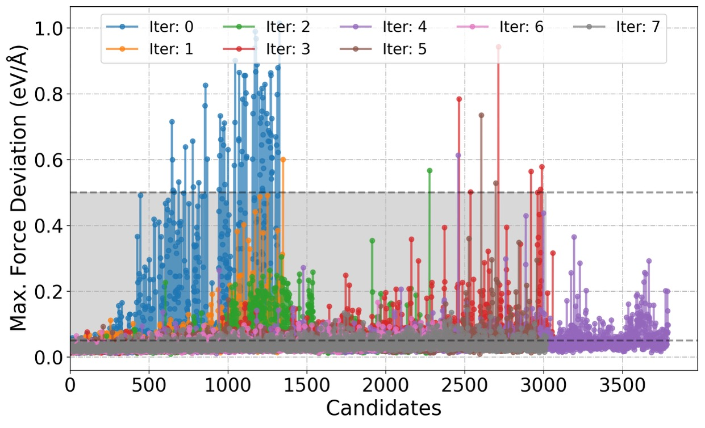

.. .. default-role:: math

.. _analysissection:

Analysis
========

.. module:: analysis

Overview
--------

During the execution of the active learning workflow for accelerated exploration of the phase space, 
it is critical to monitor the training progress and predictive reliability of the machine learning potential.
This can be achieved by systematically analyzing key indicators that reflect the current state of the model's 
learning and generalization performance.

To do this, a suite of specialized modules has been implemented to visualize a range of physical and 
statistical properties. These include, but are not limited to, learning curves 
(e.g., energy and force loss evolution), parity plots comparing predicted and reference quantities, 
model uncertainty estimations (such as ensemble variance or deviation metrics), and physical observables 
derived from molecular dynamics simulations (e.g., temperature fluctuations, and sample trajectory).

Model deviation in Forces
~~~~~~~~~~~~~~~~~~~~~~~~~

This metric tells how much different model in an ensamble ``disagree`` about the forces acting on a given atom in a specific configuration.
A large deviation means the model is uncertain and that more training data is required in that region of phase space.

Mathematically, the `force deviation <modeldevi_>`_  for atom :math:`i` is defined as:

.. math::

   \epsilon_{\mathbf{F}, i}(\mathbf{x}) = \sqrt{ \frac{1}{n_m} \sum_{k=1}^{n_m} \left\| \mathbf{F}_i^{(k)} - \bar{\mathbf{F}}_i \right\|^2 }

where:

- :math:`\mathbf{F}_i^{(k)}` is the force on atom :math:`i` predicted by model :math:`k`,
- :math:`\bar{\mathbf{F}}_i = \frac{1}{n_m} \sum_{k=1}^{n_m} \mathbf{F}_i^{(k)}` is the average force over all models,
- :math:`n_m` is the number of models in the ensemble,
- and :math:`\| \cdot \|` is the Euclidean norm.

In simple terms:

1. Predict the force on atom :math:`i` using multiple models.
2. Compute the average force.
3. Measure how much each model's prediction deviates from the average.
4. Compute the root mean square of those deviations.

This value quantifies how much the models **disagree** about the force, serving as a proxy for uncertainty.

.. _modeldevi: https://docs.deepmodeling.com/projects/deepmd/en/master/test/model-deviation.html

Function:
~~~~~~~~~

.. autofunction:: sparc.src.utils.plot_utils.PlotForceDeviation

.. toctree::
   :maxdepth: 1

   notebooks/analysisAmmoniaBorate.ipynb

.. _rmsd_analysis:

RMSD Analysis
~~~~~~~~~~~~~

Root Mean Square Deviation (RMSD) measures structural similarity between two
configurations after optimal alignment (Kabsch algorithm). SPARC exposes this
via ``sparc.src.utils.rmsd``.

**Per-frame RMSD against the first frame**

Useful for tracking how far the trajectory has moved from the starting
structure, or for quickly checking whether RMSD-based filtering would
accept or reject each frame at a given threshold:

.. code-block:: python

   from ase.io import read
   from sparc.src.utils.rmsd import kabsch_rmsd

   frames  = read("AseTraj.xyz", index=":")
   ref     = frames[0].get_positions()
   symbols = frames[0].get_chemical_symbols()
   threshold = 0.25   # Å — same value as model_dev.rmsd_threshold in input.yaml

   print(f"{'Frame':>6}  {'RMSD (Å)':>10}  {'Status'}")
   print("-" * 35)

   for i, frame in enumerate(frames):
       r = kabsch_rmsd(frame.get_positions(), ref, noH=True, symbols=symbols)
       status = "ACCEPT" if r >= threshold else "SKIP"
       print(f"{i:>6}  {r:>10.4f}  {status}")

``noH=True`` excludes hydrogen atoms from the RMSD calculation, matching the
default behaviour of SPARC's candidate filtering (``model_dev.exclude_hydrogen``).

.. autofunction:: sparc.src.utils.rmsd.kabsch_rmsd