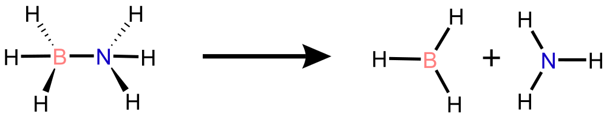

.. default-role:: math

Tutorial
========

.. module:: tutorial

Welcome to the SPARC tutorial!

Ammonia Borate (NH\ :math:`_3`\ BH\ :math:`_3`)
-----------------------------------------------

   Schematic representation of B-N bond dissociation in NH\ :math:`_3`\ BH\ :math:`_3` .

.. contents:: Table of Contents
   :depth: 2
   :local:

Introduction
************

In this tutorial, we demonstrate how to run the **SPARC** workflow end-to-end. We will show how to:

1. Prepare input files (see :ref:`inputfile` for details),
2. Prepare initial *ab initio* data,
3. Train interatomic potentials with DeepMD-kit,
4. Run machine learning molecular dynamics (ML/MD),
5. Using **active learning** with **Query-by-Committee (QbC)** to adaptively improve the model.

Preparation
***********

First, create a new test directory and download the tutorial data. If you haven't installed SPARC yet, see :doc:`install` or the :doc:`quickstart` guide.

.. code-block:: bash

   mkdir nh3bh3_test
   cd nh3bh3_test
   wget https://github.com/rahulumrao/sparc/raw/main/examples/AmmoniaBorate.zip
   unzip AmmoniaBorate.zip

You can also download the archive directly from `here <https://github.com/rahulumrao/sparc/raw/main/examples/AmmoniaBorate.zip>`_.

..   cp -r $SPARC_HOME/docs/tests/nh3bh3/* .   

If you `cd` to the unpacked folder, it will have the following files:

.. code-block:: bash

   $ cd AmmoniaBorate
   $ ls
   INCAR  POSCAR  input.json  input.yaml  iter_000000  plumed_dp.dat
   $ tree iter_000000
      iter_000000
      └── 00.dft
         └── AseMD.traj

- ``POSCAR``: Initial structure in VASP format,
- ``INCAR``: VASP input file,
- ``plumed_dp.dat``: Plumed file,
- ``input.yaml``: SPARC workflow configuration file,
- ``input.json``: DeepMD training parameters.

The file ``AseMD.traj`` inside the folder ``iter_000000/00.dft`` contains the initial AIMD data computed with VASP to start the workflow. Now we only need to prepare the ``input.yaml`` ( see :ref:`inputfile`) file, which defines the entire SPARC workflow.

The ``input.yaml`` defines the SPARC workflow, which is organized into four main steps:

1. Initial **Data preparation** with *ab initio* configurations
2. Run DeepMD-kit for **Training ML models**  interatomic potential models,
3. Use ASE MD engine together with Plumed to run **Machine Learning Molecular Dynamics (ML/MD)** sampling,
4. Iteratively improve ML potential with **Active learning** by detecting poorly represented regions with new candidates.

.. .. centered:: Each file is included in this tutorial for reference.

.. note:: 
   
   .. centered:: Each file is included in this tutorial for reference.

.. code-block:: yaml
   :caption: input.yaml

   # YAML configuration file for SPARC package
   # General settings
   general:
     structure_file: "POSCAR"           # Input structure

   # DFT calculator settings
   dft_calculator:
     engine: "VASP"                     # DFT engine name
     template_file: "INCAR"            # Path to INCAR file
     exe_command: "mpirun -np 16 /path/to/VASP/bin/vasp_std"  # VASP executable

   # Ab initio MD settings
   aimd_setup:
     ensemble: "NVT"                    # Ensemble for MD simulation
     temperature: 350.0                 # Temperature in Kelvin
     timestep_fs: 1.0                   # Timestep for MD simulation (fs)
     steps: 0                           # Number of AIMD steps (0 = skip AIMD)
     log_frequency: 1                   # Output frequency in steps
     restart: false                     # Resume from checkpoint
     thermostat:
       type: "Nose"                     # Nose-Hoover thermostat
       tdamp: 10.0                      # Damping time (fs)
     plumed:
       enabled: false                   # Enable PLUMED for AIMD
       plumed_file: "plumed_dft.dat"
       kT: 0.02585
       restart: false

   # MLIP training + ML-MD settings
   mlip_setup:
     training: false                    # Enable MLIP training
     data_dir: "Training_Data"         # Directory for training data
     input_file: "input.json"          # DeepMD training input JSON
     skip_min: 0                        # Skip first N frames
     skip_max: null                     # Skip frames beyond this index
     num_models: 2                      # Number of committee models
     MdSimulation: true                 # Run ML-MD simulation
     timestep_fs: 1.0                   # ML-MD timestep (fs)
     md_steps: 500000                   # ML-MD steps
     multiple_run: 1                    # Independent MD runs
     log_frequency: 80                  # Output frequency in steps
     thermostat:
       type: "Nose"
       tdamp: 10.0
     plumed:
       enabled: true                    # Enable PLUMED for ML-MD
       plumed_file: "plumed_dp.dat"
       kT: 0.02585
       restart: false

   # Active Learning
   active_learning: true                # Enable active learning loop
   learning_restart: false              # Resume AL from checkpoint
   latest_model: null                   # Model path on restart
   iteration: 5                         # Maximum AL iterations
   model_dev:
     f_min_dev: 0.05                    # Lower force deviation threshold (eV/Å)
     f_max_dev: 0.5                     # Upper force deviation threshold (eV/Å)

   # Distance sanity checks (optional)
   distance_metrics:
     - pair: [0, 7]
       min_distance: 1.0
       max_distance: 7.0
     - pair: [1, 7]
       min_distance: 0.8
       max_distance: 1.5
     - pair: [0, 6]
       min_distance: 0.8
       max_distance: 1.5

   # Output file names (all optional)
   output:
     log_file: "AseMD.log"
     xyz_file: "AseTraj.xyz"
     aimdtraj_file: "AseMD.traj"
     dptraj_file: "dpmd.traj"

.. - input.json

.. code-block:: json
   :caption: input.json

      {
      "_comment": " model parameters",
      "model": {
         "type_map":     ["B", "H", "N"],
         "descriptor" :{
               "type":             "se_e2_a",
               "sel":              "auto",
               "rcut_smth":        0.50,
               "rcut":             6.00,
               "neuron":           [25, 50, 100],
               "resnet_dt":        false,
               "axis_neuron":      16,
               "seed":             12123,
               "_comment":         " that's all"
         },
         "fitting_net" : {
               "neuron":           [120, 120, 120],
               "resnet_dt":        true,
               "seed":             12123,
               "_comment":         " that's all"
         },
         "_comment":     " that's all"
      },

      "learning_rate" :{
         "type":         "exp",
         "decay_steps":  5000,
         "start_lr":     0.001,
         "stop_lr":      3.51e-8,
         "_comment":     "that's all"
      },

      "loss" :{
         "type":         "ener",
         "start_pref_e": 0.02,
         "limit_pref_e": 1,
         "start_pref_f": 1000,
         "limit_pref_f": 1,
         "start_pref_v": 0,
         "limit_pref_v": 0,
         "_comment":     " that's all"
      },

      "training" : {
         "training_data": {
               "systems":          ["training_data"],
               "batch_size":       "auto",
               "_comment":         "that's all"
         },
         "validation_data":{
               "systems":          ["validation_data"],
               "batch_size":       "auto",
               "numb_btch":        1,
               "_comment":         "that's all"
         },
         "numb_steps":   500000,
         "seed":         12123,
         "disp_file":    "lcurve.out",
         "disp_freq":    1000,
         "save_freq":    10000,
         "_comment":     "that's all"
      },

      "_comment":         "that's all"
   }

.. - INCAR

.. code-block:: ini
   :caption: INCAR

   # Global Parameters #
   SYSTEM = NH3BH3
   ISTART = 0
   ICHARG = 2
   ISPIN  = 1
   ENCUT  = 300
   LCHARG = .FALSE.
   LWAVE  = .FALSE.
   # Electronic Relaxation #
   ISMEAR = 0
   SIGMA  = 0.05
   EDIFF  = 1E-05

.. - POSCAR

.. code-block:: bash
   :caption: POSCAR

   NH3BH3
   1.0000000000000000
   12.0000000000000000    0.0000000000000000    0.0000000000000000
   0.0000000000000000   12.0000000000000000    0.0000000000000000
   0.0000000000000000    0.0000000000000000   12.0000000000000000
   B    H    N
   1     6     1
   Direct
   0.3779049269710626  0.4608129327206285  0.3686019834737309
   0.6453715677372998  0.5804071143184686  0.7242016573374457
   0.5854579728428035  0.5273358295291573  0.6234820843519628
   0.6923831185069531  0.6059197989660134  0.5995049316749146
   0.4105296494597752  0.4845721146109838  0.2757983426625543
   0.3076168814930469  0.3940802010339866  0.3962878597352457
   0.4170584773274015  0.4942723187483011  0.4581363881549123
   0.6647284028152569  0.5421008292213045  0.6505695389414967

Execute SPARC
*************

.. code-block:: bash

   sparc -i input.yaml

.. warning::

   Ensure all environment variables are properly set before execution.  
   See the :ref:`quickstart` section for details.

This launches the **first iteration (``iter_000000``)**:

.. code-block:: bash

   iter_000000/
   ├── 00.dft    # Ab initio reference data
   ├── 01.train  # Training of ML models
   └── 02.dpmd   # ML-driven MD simulation

Training ML Models
******************

SPARC automatically collects *ab initio* data and prepares training/validation sets. It then launches MLIP training. Depending on user settings, SPARC trains *n* models and creates separate ``training_n`` directories.

The ``input.json`` file is native to the **DeePMD-kit** package. See the `DeepMD training documentation <https://docs.deepmodeling.com/projects/deepmd/en/stable/train/train-input.html#training>`_ for a full list of parameters.

.. code-block:: bash

   $ cd iter_000000/01.train/training_1
   $ less lcurve.out                                           
   #  step      rmse_val    rmse_trn    rmse_e_val  rmse_e_trn    rmse_f_val  rmse_f_trn         lr
   # If there is no available reference data, rmse_*_{val,trn} will print nan
   0           3.99e+01    3.18e+01      9.27e-01    9.28e-01      1.26e+00    1.01e+00    1.0e-03
   1000        6.78e+00    6.19e+00      8.65e-01    8.59e-01      2.14e-01    1.95e-01    1.0e-03
   2000        4.98e+00    4.83e+00      1.77e-01    1.57e-01      1.57e-01    1.53e-01    1.0e-03
   3000        2.00e+00    2.75e+00      8.99e-02    9.15e-02      6.32e-02    8.69e-02    1.0e-03
   .
   .
   497000      1.14e-02    8.39e-03      3.95e-04    2.66e-04      1.12e-02    8.20e-03    3.9e-08
   498000      9.45e-03    7.52e-03      1.51e-04    3.71e-04      9.26e-03    7.30e-03    3.9e-08
   499000      8.35e-03    9.65e-03      1.84e-04    1.48e-04      8.17e-03    9.46e-03    3.9e-08
   500000      1.97e-02    1.04e-02      2.98e-04    9.08e-05      1.94e-02    1.02e-02    3.5e-08

.. note::
   You can also visualize the learning process by plotting the ``lcurve.out`` file. See :ref:`AnalysisSection` section.

.. You should see a learning curve similar to:

.. .. image:: _static/learning_curve.png
..    :width: 60%
..    :align: center

Running ML/MD
*************

Once models are trained, SPARC selects one of them to initiate ML/MD simulations:

.. code-block:: bash

   $ cd iter_000000/02.dpmd
   $ ls
   AseMolDyn.log  COLVAR  dpmd.traj  HILLS_0  HILLS_1  Iter0_dpmd.log
   AseTraj.xyz    dft_candidates   model_dev_0.out   set.000  set.001
   type_map.raw   type.raw

SPARC tracks atomic force error across models:

.. code-block:: bash

   $ less model_dev_0.out
   $ # iter_000000/02.dpmd
   # step      max_devi_v         min_devi_v         avg_devi_v         max_devi_f         min_devi_f         avg_devi_f             devi_e
      0       4.288987e-02       1.236075e-03       2.209929e-02       8.148417e-01       5.249647e-02       3.124690e-01       3.175687e-02
      1       9.956690e-02       2.644640e-03       4.849840e-02       4.707522e-01       9.577766e-02       2.531237e-01       1.749532e-02
      2       1.359298e-01       5.290284e-03       6.208815e-02       3.054830e-01       6.672351e-02       1.852998e-01       2.692625e-02
      3       8.619494e-02       1.549988e-02       4.847261e-02       2.494638e-01       9.084693e-03       1.613021e-01       2.746094e-02
      4       1.177004e-01       5.339600e-03       5.895431e-02       2.977156e-01       2.450532e-02       1.692072e-01       3.893455e-02

Frames with atomic forces between the thresholds are automatically flagged as candidates for relabeling using *ab intio* and are stored in ``iter_000000/02.dpmd/dft_candidates`` folder. These will appear in the **next iteration** folder.

.. code-block:: bash

   $ ls iter_000000/02.dpmd/dft_candidates
   0001 0002 0003 0004 0005 0006 0007 0008 0009 0010
   $ tree iter_000000/02.dpmd/dft_candidates
      ├── 0001
      │   └── POSCAR
      ├── 0002
      │   └── POSCAR

Active Learning Loop
********************

The workflow continues automatically:

.. code-block:: bash

   iter_000001/
   ├── 00.dft
   ├── 01.train
   └── 02.dpmd

Each AL cycle consists of:

1. Selecting new candidate structures,
2. Relabeling with *ab initio*,
3. Retraining ML models,
4. Running ML/MD with updated potentials.

Monitor Workflow
****************

SPARC provides utilities for monitoring the workflow. For example:

.. code-block:: python

   from sparc.src.utils import PlotForceDeviation
   PlotForceDeviation("iter_000000/02.dpmd/", iteration_window='all')

.. note::

   See the notebook for analysis functions and figures:

   .. toctree::
      :maxdepth: 1

      notebooks/analysisAmmoniaBorate.ipynb

PLUMED Plugin
*************

SPARC is primarily designed to streamline the generation of training data. By using it with **PLUMED** plugin, standard molecular dynamics simulations can be extended beyond equilibrium sampling. This enables the ML potential to explore new regions of configurational space by applying appropriate acceleration or biasing strategies.

To enable PLUMED, set the ``plumed`` block under ``mlip_setup`` in ``input.yaml``:

.. code-block:: yaml

   mlip_setup:
     plumed:
       enabled: true
       plumed_file: "plumed_dp.dat"

An example PLUMED input file (``plumed_dp.dat``) is provided in this tutorial. It defines
the collective variables and biasing scheme for the NH\ :math:`_3`\ BH\ :math:`_3` system.
See the `PLUMED documentation <https://www.plumed.org/>`_ for details on constructing
custom CVs and bias potentials.

.. - plumed.dat

.. code-block:: ini
   :caption: plumed_dp.dat

   # PLUMED
   d1: DISTANCE ATOMS=1,8

   UPPER_WALLS ARG=d1 AT=0.55 KAPPA=100000.0 EXP=2 EPS=1 OFFSET=0 LABEL=uwall

   # Define species for contact matrix
   # n=6, m=12, R0=0.265(nm) [B/N-B/N], and R0=0.222(nm) [C-H]
   DENSITY SPECIES=1  LABEL=B
   DENSITY SPECIES=2-7 LABEL=H
   DENSITY SPECIES=8 LABEL=N

   # B-B B-H B-N H-H H-N N-N
   contact_mat: CONTACT_MATRIX ATOMS=B,H,N SWITCH11={RATIONAL D_0=0.0 R_0=0.800 NN=6 MM=12} SWITCH12={RATIONAL D_0=0.0 R_0=0.125 NN=6 MM=12}  SWITCH13={RATIONAL D_0=0.0 R_0=0.222 NN=6 MM=12} SWITCH22={RATIONAL D_0=0.0 R_0=0.500 NN=6 MM=12} SWITCH23={RATIONAL D_0=0.0 R_0=0.125 NN=6 MM=12} SWITCH33={RATIONAL D_0=0.0 R_0=0.800 NN=6 MM=12}

   # SPRINT coordinate
   ss: SPRINT MATRIX=contact_mat

   # PbMetaD
   pb: PBMETAD ARG=ss.coord-0,ss.coord-7 SIGMA=0.1,0.1 HEIGHT=2.0 PACE=1000 FILE=HILLS_0,HILLS_1

   #
   PRINT ARG=d1,ss.*,pb.* FILE=COLVAR STRIDE=3

   # FLUSH data
   FLUSH STRIDE=250

Next Step
*********

- Try replacing the system with your own molecule.

