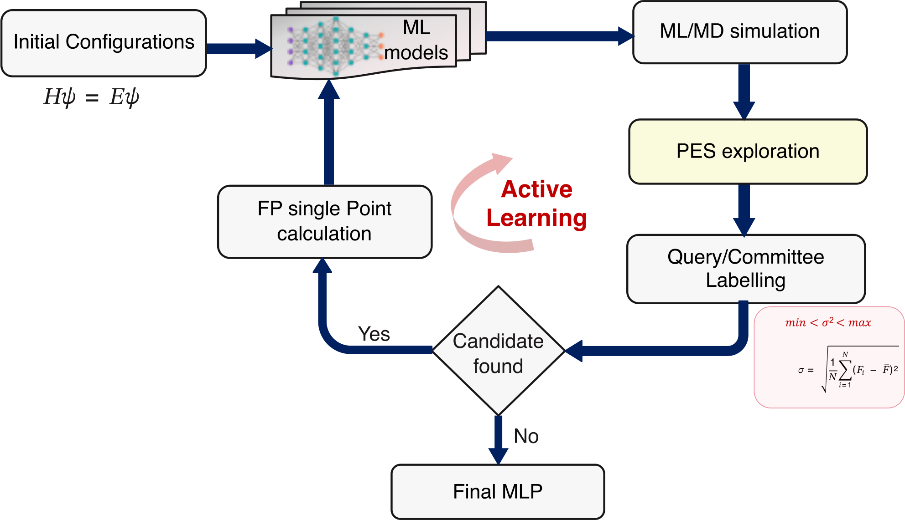

.. _workflow_overview:

Workflow Overview
=================

SPARC implements an active learning loop for machine learning interatomic
potential (MLIP) development. Each iteration follows three stages that map
directly to sub-directories created inside ``iter_xxxxxx/``:

.. code-block:: text

    iter_000000/
    ├── 00.dft/     ← Stage 1: DFT / AIMD labelling
    ├── 01.train/   ← Stage 2: MLIP training
    └── 02.dpmd/    ← Stage 3: ML-MD + Query-by-Committee

Stage 1 — DFT / AIMD (``00.dft``)
-----------------------------------

Ab initio molecular dynamics (AIMD) or single-point DFT calculations are run
to label new candidate structures. This stage is controlled by the
``aimd_setup`` and ``dft_calculator`` sections of ``input.yaml``.

Set ``aimd_setup.steps: 0`` to skip AIMD entirely and jump straight to
training. In this case, place pre-existing trajectory data as
``AseMD.traj`` (ASE trajectory format) inside the ``00.dft/`` directory
of the current iteration before running.

Stage 2 — MLIP Training (``01.train``)
----------------------------------------

``num_models`` independent MLIP models are trained on the accumulated dataset.
Each model is placed in its own ``training_x/`` sub-directory. Controlled by
``mlip_setup.training`` and ``mlip_setup.input_file``.

For fine-tuning from a pre-trained foundation model instead of training from
scratch, see :doc:`fine_tuning`.

Stage 3 — ML-MD + Query-by-Committee (``02.dpmd``)
----------------------------------------------------

ML-driven molecular dynamics explores configuration space using the trained
committee of models. The force deviation across models (``model_dev_*.out``)
identifies uncertain structures as candidates for DFT relabelling in the next
iteration. Controlled by the ``mlip_setup.MdSimulation`` block.

How sections in ``input.yaml`` map to stages
---------------------------------------------

.. list-table::
   :header-rows: 1
   :widths: 35 65

   * - ``input.yaml`` section
     - Controls
   * - ``general``
     - Input structure file(s)
   * - ``dft_calculator``
     - DFT engine and template for Stage 1
   * - ``aimd_setup``
     - AIMD run in Stage 1
   * - ``mlip_setup``
     - Training (Stage 2) and ML-MD (Stage 3)
   * - ``finetune``
     - Optional fine-tuning instead of from-scratch training (Stage 2)
   * - ``active_learning``
     - Loop control: iterations, deviation thresholds
   * - ``distance_metrics``
     - Optional geometry sanity checks during ML-MD
   * - ``output``
     - Custom output filenames

Loop termination
----------------

The loop runs for ``active_learning.iteration`` cycles. It also stops early
if no candidate structures are found in a given cycle (the model has converged
for the sampled region of phase space).

To resume an interrupted run, set ``learning_restart: true`` and supply
``latest_model`` pointing to the last frozen model checkpoint.
