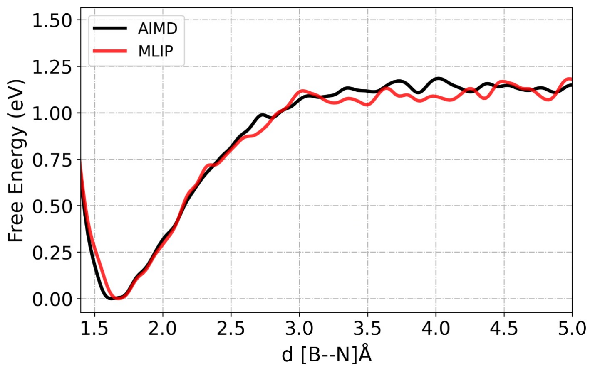

# Summary

Machine learning interatomic potentials (MLIPs) are rapidly becoming an essential modeling tool, as they allow atomistic simulations to achieve larger systems and longer time scales, while retaining the accuracy of ab-initio methods. However, constructing a reactive and transferable MLIP is still challenging, as it requires high quality training data including rare events, high energy intermediates and transition states.

Herein, we present `SPARC` (Smart Potential with Atomistic Rare events and Continuous learning), a modular Python workflow which automates the construction of reactive MLIPs that can generate chemically accurate potential energy surfaces (PES) for rare events.  The idea for `SPARC` is to use an active learning (AL) protocol coupled with advanced sampling techniques that systematically identify new configurations and train ML models on-the-fly. The workflow consists of three main steps, which are executed iteratively in a loop until a reactive and stable MLIP is constructed. `SPARC` also includes utilities for visualizing configurations and plotting various properties to monitor the workflow across iterations.

# Statement of need

While the AL protocol [@podryabinkin2017ActiveLearning] [@miksch2021strategiesMLPs] has become a standard approach to refine ML models, it does not guarantee access to kinetically or thermodynamically rare events. Many learning schemes for MLIP invoke the use of higher temperature simulations to enhance phase space exploration. Even so, without additional enhanced sampling there is little to no possibility of systematically achieving reliable reactive MLIPs. 

The motivation behind `SPARC` is to simplify the generation of high-quality training data and minimize the level of manual intervention required from the user. Although AL strategies have already proven effective for expanding training datasets, their integration with enhance sampling techniques have typically been done in an ad hoc and largely manual manner. This makes it difficult to generalize these workflows beyond the original problem and limits reproducibility. 

Several groups have coupled AL with enhanced sampling or pathway exploration techniques. Vitartas et al. [@vitartas2025ArXiv] combined AL with well-tempered metadynamics to study organic reactions in both gas phase and solvent. Rivero et al. [@rivero2019JCP] trained PhysNet architecture together with an AL at 1000K MD for Diels–Alder and hydrogen transfer reactions. Ang et al. [@ang2021Chem] used SchNet combined with nudged elastic band calculations to explore solvent effects on pericyclic reactions. Parrinello and coworkers [@parrinello2020NatCom] coupled AL with variational enhanced sampling using DeePMD to investigate the phase diagram of gallium. Zhao et al. [@zhao2022umbrella] introduced a workflow combining umbrella sampling with AL to map out the solid-phase transition of GeSbTe. These studies highlight the promise of AL combined with enhanced sampling, but they remain highly tailored and driven by use case-specific implementations that can be difficult to generalize or reproduce.

`SPARC` automates this process by integrating PLUMED library [@tribello2014plumed] with AL protocol into a single modular workflow (see Figure 1). This allows user to use any advance sampling technique implemented in PLUMED to explore the configurational space and finding reactive configurations enabling scalable and reproducible MLIPs for generalized chemical environment.

<!--  -->

# Features and Implementation


`SPARC` is written in Python and can run on both local workstations and high-performance clusters. We utilized the Atomic Simulation Environment (ASE) [@AtomicSimulationEnvironment] library as the brain for `SPARC` which enables seamless integration of the MD engine, machine learning architecture, and electronic structure codes. To ensure portability, `SPARC` implements a file-based management system, and the output of each stage is written in a structured directory. The workflow iterations are stored in subdirectories (`iter_000000`, `iter_000001`,), with subfolders for reference first principle (FP) calculations (`00.dft`), MLIP training (`01.train`), and ML/MD simulations (`02.dpmd`). The `SPARC` workflow is controlled through a single YAML configuration file.

`SPARC` currently supports VASP [@hafner2008vasp] and CP2K [@hutter2014cp2k] for electronic structure calculation, although this could be readily expanded in the future. For MLIP training we use DeePMD-kit architecture [@wang2018deepmd], with the ensemble model approach for query-by-committee (QbC) uncertainty estimation [@miksch2021strategiesMLPs]. ML/MD simulations are run using ASE MD engine coupled together with both DeePMD and PLUMED calculator.

ML/MD output is stored in ASE trajectory formats as this enables the broader ecosystem of analysis tools that already support ASE compatible formats. Since `SPARC` manages all stages via ASE, no additional infrastructure is needed beyond a Python environment with the required dependencies installed. This makes the workflow highly portable across computing environments and suitable for both exploratory studies and large-scale production run.

{ width=350px }

# Technical requirements and usage examples

After installation, a typical `SPARC` workflow can be launched with a single command:

```yaml
sparc -i input.yaml
```

# Illustrative Example: Potential Energy Scan

<!-- To illustrate the capabilities of SPARC, we applied the workflow to a simple **ammonia borane (NH<sub>3</sub>BH<sub>3</sub>)** molecule.. The goal is to demonstrate how SPARC systematically expands training data and improves the accuracy of MLIPs through iterative active learning. -->

To illustrate the capabilities of `SPARC`, we applied the workflow to a simple ammonia borate (NH$_3$BH$_3$) molecule. The goal is to demonstrate how `SPARC` systematically expands training data and improves the accuracy of MLIPs through iterative learning.  The initial training dataset only has 64 cofigurations, generated by scanning the B-N bond at semiempirical level, followed by DFT single point calculations at PBE level with energy cutoff of 300 eV in VASP. 

An ensemble of DeePMD models were trained and one of the ML models was used to run MD simulation for 5 ns with a timestep of 1 fs for each iteration. To ensure exploration beyond equilibrium structures, enhanced sampling was employed using parallel bias metadynamics (PbMetaD) [@pfaendtner2015PbMetaD] on SPRINT collective variables [@pietrucci2011sprint].  We obtain the uncertainty in forces by using an ensemble of trained models within QbC approach [@miksch2021strategiesMLPs] to flag configurations. Then configurations with standard deviation in the atomic forces between 0.05 to 0.5 eV/Å were automatically flagged and labeled with DFT. These structures were then added into the existing training dataset, after which the DeePMD models were retrained to get updated potential for the next cycle. 

The effect of this iterative refinement is shown in \autoref{fig:error} which plots the maximum force deviation recorded in each cycle. In the initial iterations, deviations were large. As the workflow explores the chemical space and finds new configurations, these errors slowly decreased, indicating that the model was progressively learning the relevant physics. 

{ width=350px }

By the fourth iteration, the error had converged to near-zero values, reflecting a stable and reactive MLIP. During exploration the model will be exposed to new configurations beyond training data which can result in very high forces, as observed in iteration 2.


We further assessed the reliability of trained MLIP under finite-temperature molecular dynamics. We performed enhanced sampling MD for both ab-initio and ML. In these simulations, the B-N bond distance was biased with metadynamics with a Gaussian width 0.05 Å and height 0.005 eV. The resulting free energy profiles is shown in \autoref{fig:fesProfile}.

{ width=400px }

Here, MLIP was able to reproduce minima near 1.6 Å, with some minor discrepancies after 3.0 Å. The root mean square deviation between these curves was 0.04 eV, which is within chemical accuracy. 

These results demonstrate MLIP trained with our workflow not only reproduces potential energy surface but also able to estimate quantitatively reliable predictions for computing free barriers and investigating chemical reactions.

# Acknowledgements

This work was partially supported by NSF award EFRI-2132219 to RV and JP, and the HPC facility at the NC State University.

# Related software

`SPARC` interface builds upon the following packages:

- [ASE](https://wiki.fysik.dtu.dk/ase/): atomic simulation setup, DFT calculators, and file handling.  
- [DeePMD-kit](https://github.com/deepmodeling/deepmd-kit): MLIP training and deployment.  
- [PLUMED](https://www.plumed.org/): enhanced sampling and CV biasing.  
- [VASP](https://www.vasp.at/) and [CP2K](https://www.cp2k.org/): first-principles labeling.  

<!-- # References -->


